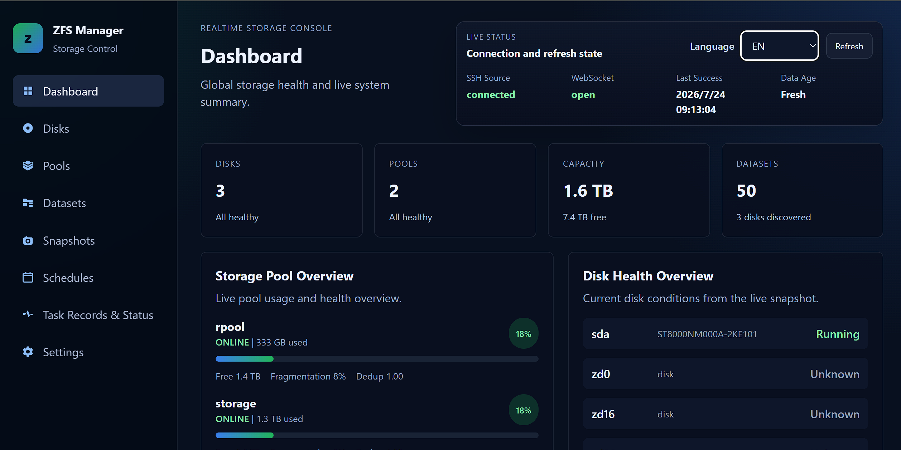
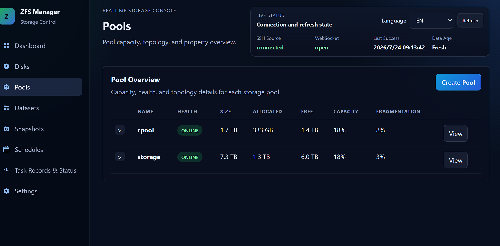
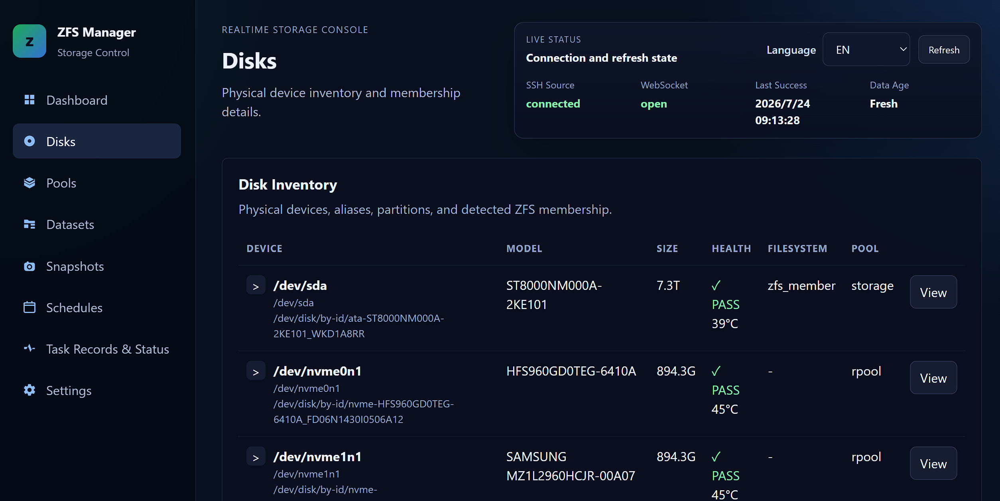
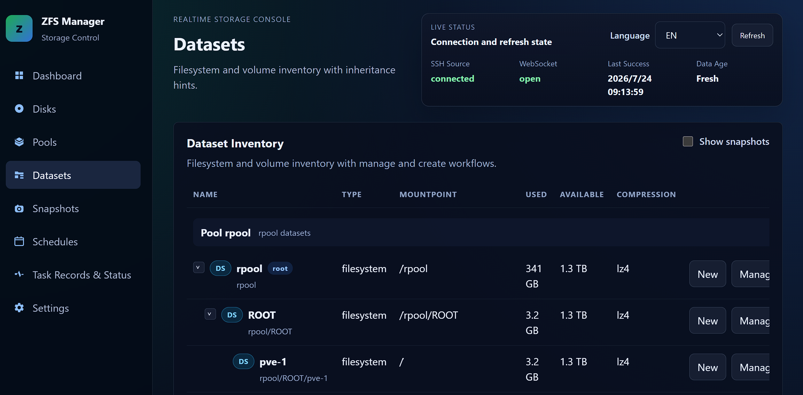
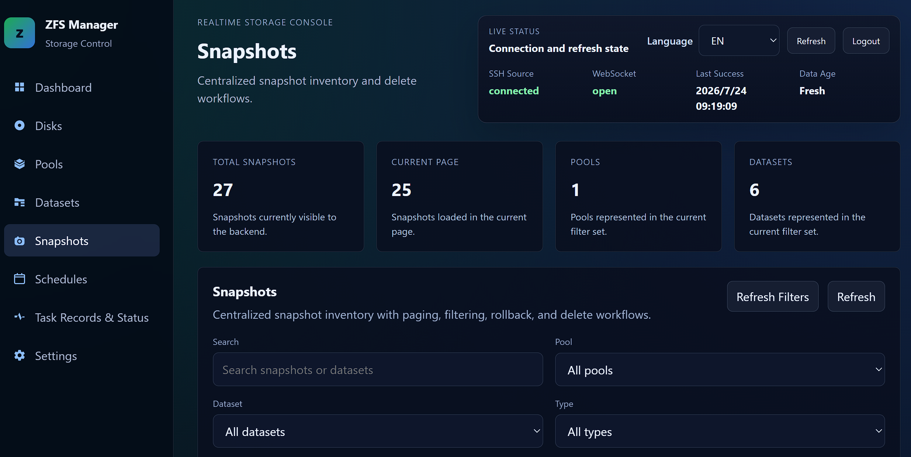
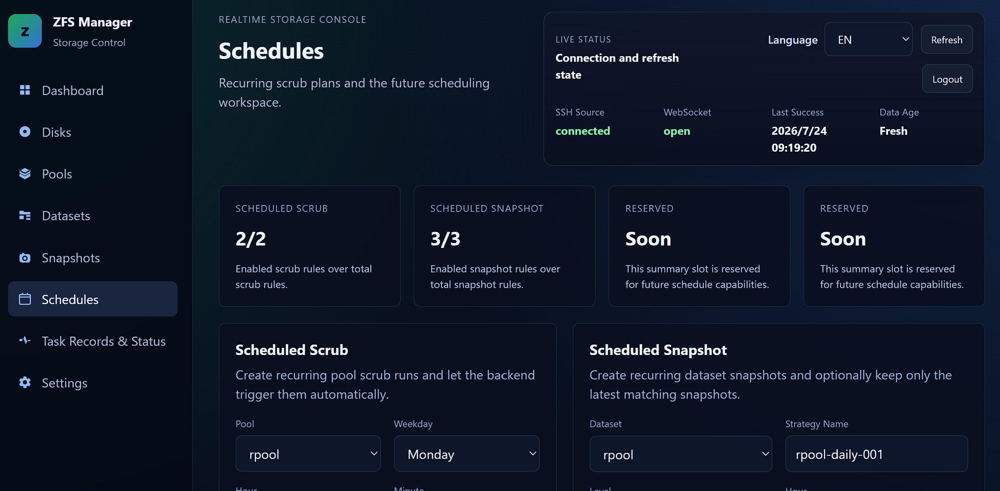
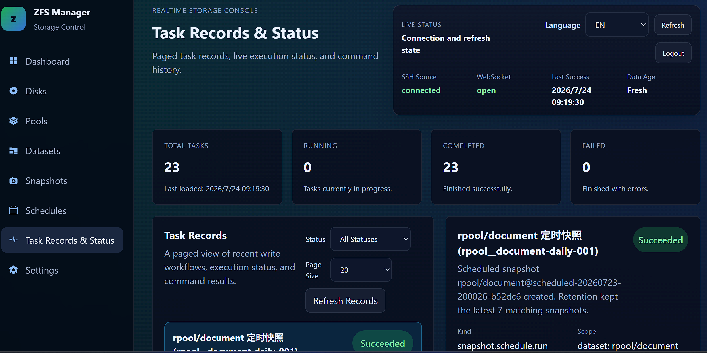
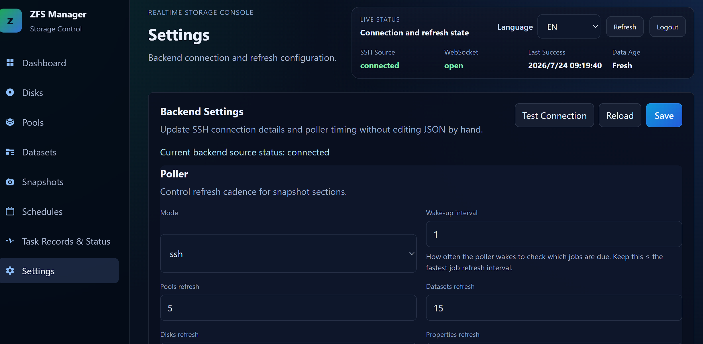

# ZFS Manager

> [中文版本](./README.zh-CN.md)

A web console that manages a remote ZFS host over SSH. ZFS Manager brings pools, datasets, zvols, snapshots, disk health, maintenance tasks, and recurring schedules into one interface for single-node and small-lab environments.

> This project executes mutating `zpool` and `zfs` commands. Before destroying, removing, replacing, or rolling back anything, make sure you have a usable backup and understand the corresponding ZFS behavior.

## Features

### Dashboard and live state

- Summarizes disks, pools, capacity, and datasets
- Shows pool health, capacity, fragmentation, and dedup ratio
- Shows disk runtime state and SMART health summaries
- Streams one normalized state snapshot over WebSocket
- Displays connection state, backend source state, last successful refresh, and data freshness
- Supports a forced full refresh from the top bar
- Optional raw JSON debug panel with `VITE_SHOW_JSON_DEBUG=true`

### Disks and SMART

- Lists disks, partitions, models, capacity, filesystems, and pool ownership
- Shows both kernel paths and stable `/dev/disk/by-id` paths
- Persists operator-defined disk labels by `diskKey`
- Filters non-physical devices such as `loop`, `ram`, `fd`, `sr`, `zd`, and `zram`
- Automatically polls `smartctl --json` with separate active and idle intervals
- Shows PASS/FAIL, temperature, power-on hours, protocol, serial, firmware, and a full attribute table
- Parses both ATA SMART attributes and NVMe health logs
- Can trigger a full SMART/state refresh from a disk detail view

### Pool management

- Inspect health, capacity, properties, and visual topology
- Create and destroy pools
- Configure data vdevs, `log`, `cache`, `special`, `dedup`, `spare`, and root-dataset properties during creation
- Edit supported pool properties
- Add `log`, `cache`, `special`, `dedup`, and `spare` devices to an existing pool
- Remove targets marked removable by the current topology snapshot
- Start and stop `scrub`, with progress and ETA
- Run pool-level `clear`
- Run device-level `offline`, `online`, and `replace`
- Track the `resilver` that follows replacement
- Perform vdev-level RAID-Z expansion through `zpool attach`, tracking both expansion and automatic scrub phases

### Datasets and zvols

- Expandable hierarchical tree
- Create, edit, and destroy filesystem datasets and zvols
- Grouped property inspection and inline editing for supported fields
- Required `volsize` validation when creating a zvol
- Optional snapshot rows to keep large snapshot sets from overwhelming the tree
- Quick manual or recursive snapshot creation from the dataset page

### Snapshot management

- Dedicated snapshot page with pagination and search
- Filter by pool, dataset, and snapshot type
- Sort by creation time, name, dataset, used space, or referenced space
- Inspect creation time, space usage, user references, and manual/scheduled type
- Delete snapshots that have no active user references
- Three rollback modes: regular rollback, prune newer snapshots (`-r`), or handle wider dependencies (`-R`)

### Tasks and schedules

- Records pool, dataset, and snapshot writes as tasks
- Persists tasks, schedules, commands, exit codes, stdout, and stderr in SQLite
- Task list with pagination, status filtering, details, and automatic refresh
- Recovers unfinished tasks on backend startup and reconciles them against current ZFS state
- Weekly recurring `scrub`
- Minutely, hourly, daily, weekly, and monthly recurring snapshots
- Create, enable, disable, and delete schedules
- Recursive recurring snapshots and `keep latest N` retention
- Stores schedule ownership in ZFS user properties so cleanup cannot affect manual snapshots or another schedule's snapshots

### Settings, locale, and login

- Edit polling, SSH, and login settings from the web UI
- Rebuilds the backend runtime after saving so new settings take effect immediately
- Tests SSH connectivity without saving
- Client-aware polling: fast while a browser is connected, slower while idle
- Separate active and idle intervals for pools, datasets, disks, properties, and SMART
- Built-in English and Simplified Chinese with browser detection and persisted preference
- Optional password gate with a shared cookie session for REST and WebSocket
- SSH password or key authentication, including configurable `known_hosts` verification

## Screenshots

| Dashboard | Pools |
|:---:|:---:|
|  |  |

| Disks (with SMART health) | Datasets |
|:---:|:---:|
|  |  |

| Snapshots | Schedules |
|:---:|:---:|
|  |  |

| Tasks | Settings |
|:---:|:---:|
|  |  |

## Architecture

```text
Remote ZFS host
    ↑ AsyncSSH: lsblk / blkid / smartctl / zpool / zfs
FastAPI backend
    ├─ polls and normalizes a shared state snapshot
    ├─ executes writes through REST
    ├─ streams state over WebSocket
    └─ persists tasks and schedules in SQLite
    ↓
Vue 3 frontend
```

| Layer | Technology |
|-------|------------|
| Frontend | Vue 3, Vite, Vue Router, Pinia, vue-i18n |
| Backend | FastAPI, Pydantic, AsyncSSH |
| Live transport | WebSocket |
| Writes | REST → SSH → `zpool` / `zfs` |
| Persistence | SQLite for tasks/schedules; JSON for settings/disk labels |
| Deployment | Docker, Nginx, Uvicorn |

## Quick Start

### Docker Compose

Copy the example and update its environment variables for the remote host:

```bash
cp compose.example.yaml compose.yaml
docker compose up --build -d
```

Open `http://localhost:8080`. Configuration and the task database are stored in the volume mounted at `/data`. For SSH key authentication, mount the key read-only and set `ZFS_MANAGER_SSH_KEY_FILES`.

### Local development

Local development requires Python 3.12, Node.js 22, and an SSH-accessible target. The target must have the ZFS command-line tools installed. SMART monitoring additionally requires `smartmontools`, and the SSH user must be allowed to read disk SMART data and execute the required ZFS commands.

```bash
# Backend
cd backend
python -m venv .venv
source .venv/bin/activate
pip install -r requirements.txt
cp -n config/config.example.json config/config.json
uvicorn app.main:app --reload
```

Start the frontend in another terminal:

```bash
cd frontend
npm install
npm run dev
```

The development UI runs at `http://127.0.0.1:5173` and connects to `http://127.0.0.1:8000` by default. FastAPI documentation is available at `http://127.0.0.1:8000/docs`.

## Configuration

The default configuration file is `backend/config/config.json`; see `backend/config/config.example.json`:

- `poller`: `fixture`/`ssh` mode, fallback behavior, and active/idle intervals for five jobs
- `ssh`: target, username, password or keys, `known_hosts`, timeouts, and keepalive
- `auth`: optional web password gate
- `disk_labels`: application-managed operator labels

Use `ZFS_MANAGER_CONFIG` and `ZFS_MANAGER_TASK_DB` to override the configuration and SQLite paths. Docker also supports `ZFS_MANAGER_POLLER_*`, `ZFS_MANAGER_SSH_*`, and `ZFS_MANAGER_AUTH_*` variables; see [`compose.example.yaml`](./compose.example.yaml).

`fixture` mode is intended for UI development and demonstrations and does not provide SMART fixture data. ZFS writes, manual SMART refresh, and recurring schedules require `ssh` mode.

## Current Boundaries

- The current target is a single node or small lab, not a multi-tenant or fleet-management platform.
- Existing-pool topology updates currently support auxiliary classes only; adding a new data vdev is not exposed yet.
- Recurring scrub currently supports weekly schedules only; recurring snapshots support minutely through monthly schedules.
- Schedules can be enabled, disabled, and deleted in the UI; a complete edit-existing-schedule UI is still pending.
- Active tasks reconcile at startup, after relevant pool-maintenance or scheduled-scrub refreshes, and when task APIs are queried; an independent continuous background reconciler is still pending.
- The web password is a lightweight access gate. When exposing the service, place it behind a trusted HTTPS reverse proxy and protect SSH credentials and the persistent data volume.

## Verification

```bash
cd backend && pytest -q
cd frontend && npm run build
```

## Documentation

- [Backend guide](./backend/README.md)
- [Frontend guide](./frontend/README.md)
- [Project documentation index](./Documents/README.md)
- [Task system architecture](./Documents/TaskSystemArchitecture.md)
- [Snapshot management architecture](./Documents/SnapshotManagementArchitecture.md)
- [Pool maintenance architecture](./Documents/PoolMaintenanceArchitecture.md)
