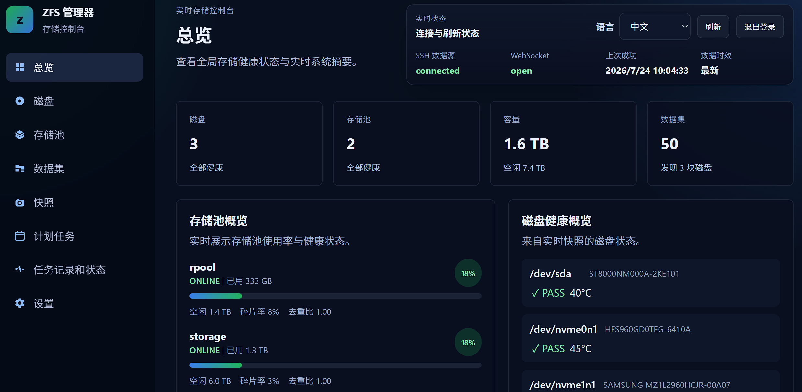
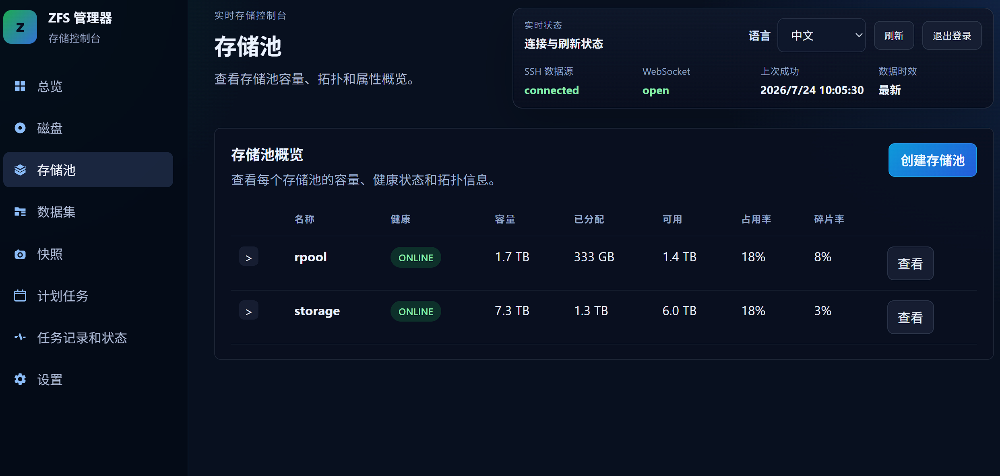
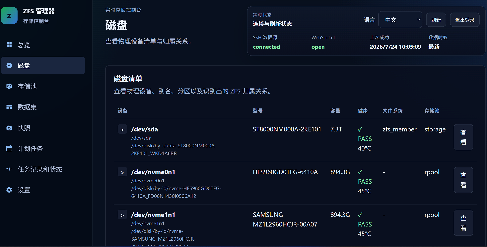
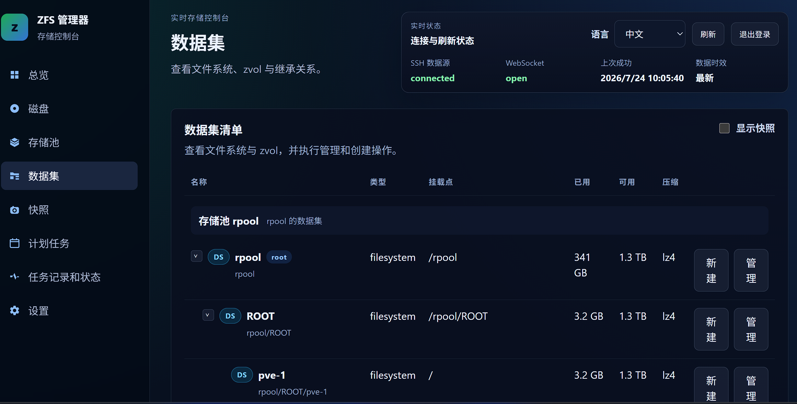
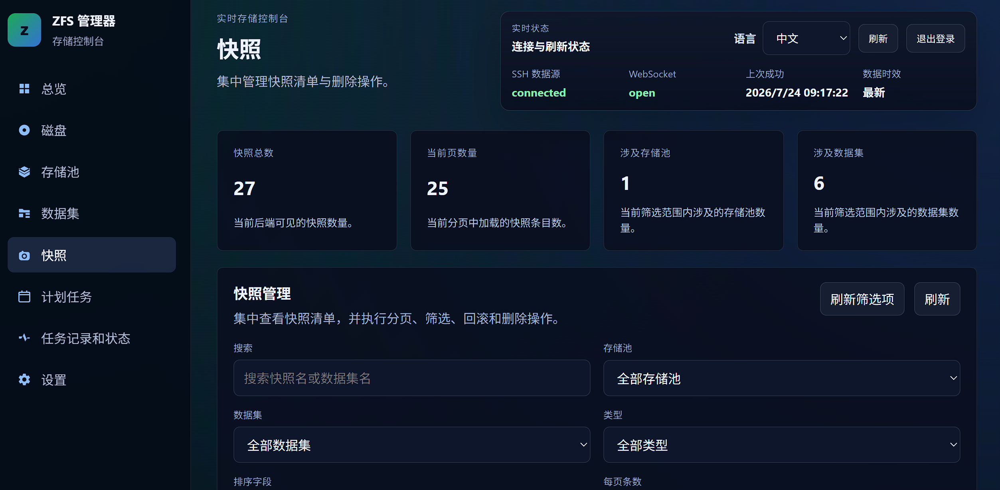
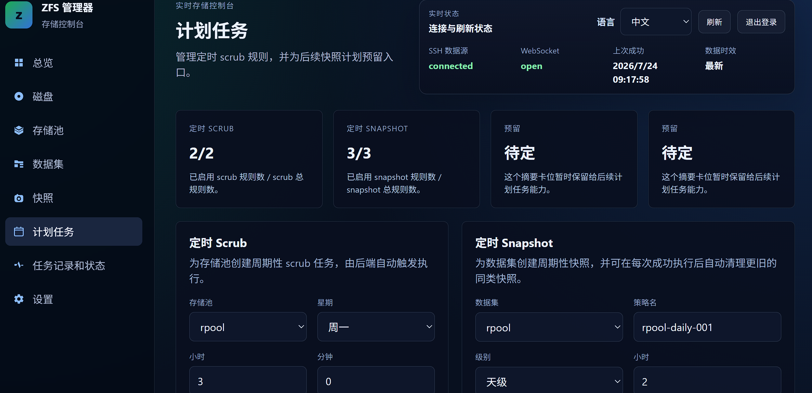
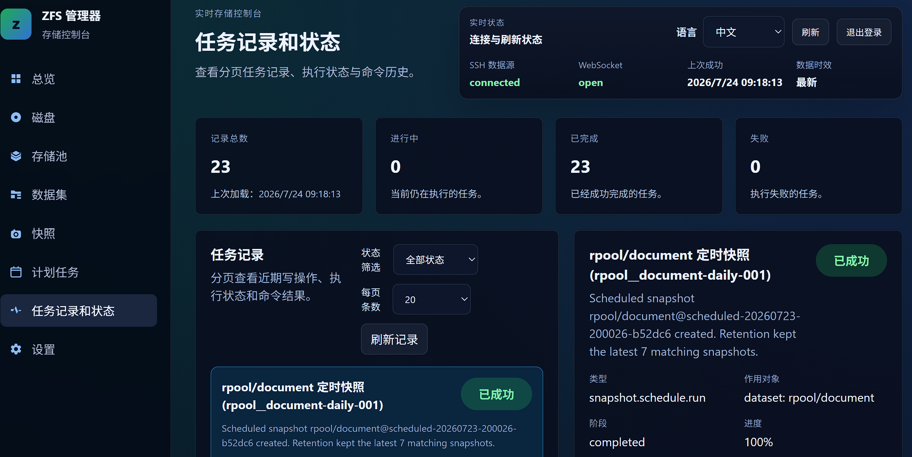
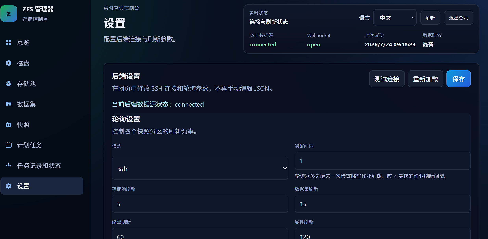

# ZFS Manager

> [English Version](./README.md)

一个通过 SSH 管理远程 ZFS 主机的 Web 控制台。ZFS Manager 将存储池、数据集、Zvol、快照、磁盘健康、维护任务和计划任务集中到一个界面中，适合单机或小型实验环境。

> 项目会执行 `zpool` 和 `zfs` 写命令。进行销毁、移除、替换或回滚前，请确认已有可用备份并理解对应 ZFS 行为。

## 功能

### 仪表盘与实时状态

- 汇总磁盘、存储池、容量和数据集数量
- 展示存储池健康、容量、碎片率和去重比
- 展示磁盘运行状态和 SMART 健康摘要
- WebSocket 推送统一状态快照
- 顶栏显示连接状态、数据源状态、最后成功时间和数据时效
- 支持手动强制全量刷新
- 可选原始 JSON 调试面板（`VITE_SHOW_JSON_DEBUG=true`）

### 磁盘与 SMART

- 展示磁盘、分区、型号、容量、文件系统和所属存储池
- 同时展示内核路径与稳定的 `/dev/disk/by-id` 路径
- 通过 `diskKey` 持久化磁盘自定义名称
- 自动过滤 `loop`、`ram`、`fd`、`sr`、`zd` 和 `zram` 等非物理设备
- 自动轮询 `smartctl --json`，活跃与空闲间隔可独立配置
- 展示 PASS/FAIL、温度、通电时间、协议、序列号、固件和完整属性表
- 同时解析 ATA SMART 属性和 NVMe 健康日志
- 支持从磁盘详情触发全量 SMART/状态刷新

### 存储池管理

- 查看健康、容量、属性和可视化拓扑
- 创建和销毁存储池
- 创建时配置 data vdev、`log`、`cache`、`special`、`dedup`、`spare` 以及根数据集属性
- 编辑支持的存储池属性
- 向已有池添加 `log`、`cache`、`special`、`dedup` 和 `spare` 设备
- 移除当前拓扑快照标记为可移除的目标
- 启动/停止 `scrub`，展示进度和 ETA
- 执行 pool 级 `clear`
- 执行设备级 `offline`、`online` 和 `replace`
- 跟踪 replace 后的 `resilver`
- 通过 vdev 级 `zpool attach` 执行 RAID-Z expansion，并跟踪 expansion 与自动 scrub 两个阶段

### 数据集与 Zvol

- 层次化树形视图和展开/折叠
- 创建、修改和销毁 filesystem dataset 与 zvol
- 分组查看属性并 inline 编辑支持的字段
- 创建 zvol 时校验必需的 `volsize`
- 可选显示快照，避免大型快照集合干扰数据集树
- 从数据集页面快速创建手动或递归快照

### 快照管理

- 独立快照页面，支持分页和搜索
- 按存储池、数据集和快照类型筛选
- 按创建时间、名称、数据集和空间占用排序
- 查看快照创建时间、空间占用、引用量和手动/计划类型
- 删除没有活动用户引用的快照
- 三种回滚模式：普通回滚、删除后续快照（`-r`）和处理更广依赖（`-R`）

### 任务与计划任务

- Pool、dataset 和 snapshot 写操作统一记录为任务
- SQLite 持久化任务、计划、命令、退出码、标准输出和错误输出
- 任务列表支持分页、状态筛选、详情和自动刷新
- 后端启动时恢复未完成任务，并根据当前 ZFS 状态对账
- 支持每周定时 `scrub`
- 支持分钟、小时、天、周、月级定时快照
- 支持创建、启用、停用和删除计划
- 支持递归定时快照和 `keep latest N` 保留策略
- 计划归属写入 ZFS 用户属性，清理不会影响手动快照或其他计划创建的快照

### 设置、语言和登录

- 在网页中修改轮询、SSH 和登录配置
- 保存设置后重建后端 runtime，使配置立即生效
- 保存前独立测试 SSH 连接
- 客户端感知轮询：浏览器在线时使用快速间隔，无客户端时使用低频空闲间隔
- pools、datasets、disks、properties 和 SMART 的活跃/空闲间隔均可配置
- 内置英文和简体中文，自动检测浏览器语言并持久化偏好
- 可选网页密码登录，REST 与 WebSocket 共用 Cookie 会话
- 支持 SSH 密码或密钥认证，以及 `known_hosts` 校验配置

## 截图预览

| 总览 | 存储池 |
|:---:|:---:|
|  |  |

| 磁盘（含 SMART 健康） | 数据集 |
|:---:|:---:|
|  |  |

| 快照 | 计划任务 |
|:---:|:---:|
|  |  |

| 任务记录 | 设置 |
|:---:|:---:|
|  |  |

## 架构

```text
远程 ZFS 主机
    ↑ AsyncSSH：lsblk / blkid / smartctl / zpool / zfs
FastAPI 后端
    ├─ 轮询并规范化为统一状态快照
    ├─ REST 执行写操作
    ├─ WebSocket 推送状态
    └─ SQLite 保存任务与计划
    ↓
Vue 3 前端
```

| 层级 | 技术 |
|------|------|
| 前端 | Vue 3、Vite、Vue Router、Pinia、vue-i18n |
| 后端 | FastAPI、Pydantic、AsyncSSH |
| 实时传输 | WebSocket |
| 写操作 | REST → SSH → `zpool` / `zfs` |
| 持久化 | SQLite（任务与计划）+ JSON（设置与磁盘标签） |
| 部署 | Docker、Nginx、Uvicorn |

## 快速开始

### Docker Compose

示例 Compose 会直接拉取 Docker Hub 上的 `rayspeedgame/zfs-manager:latest`，无需在部署主机安装 Node.js 或 Python，也无需克隆源码进行本地构建。

1. 下载或复制 [`compose.example.yaml`](./compose.example.yaml)，并创建部署配置：

```bash
cp compose.example.yaml compose.yaml
```

2. 编辑 `compose.yaml`，至少设置远程 ZFS 主机地址、SSH 用户和认证信息，并修改默认的网页登录密码。不要把真实密码提交到 Git。

3. 拉取镜像并启动：

```bash
docker compose pull
docker compose up -d
```

4. 检查运行状态和日志：

```bash
docker compose ps
docker compose logs -f zfs-manager
```

默认通过 `http://localhost:8080` 访问。应用设置和任务数据库保存在 `zfs_manager_data` 卷挂载的 `/data` 中，普通 `docker compose down` 不会删除该卷。

使用 SSH 密钥时，请删除 `ZFS_MANAGER_SSH_PASSWORD`，只读挂载密钥，并设置 `ZFS_MANAGER_SSH_KEY_FILES`。远程主机需要安装 ZFS 命令行工具和 `smartmontools`，SSH 用户需要具备相应读取与管理权限。

升级到最新镜像：

```bash
docker compose pull
docker compose up -d
```

如需可复现部署，建议把 `latest` 替换为实际发布的固定版本标签。

### 本地开发

需要 Python 3.12、Node.js 22，以及一台可通过 SSH 访问的目标主机。目标主机需要安装 ZFS 命令行工具；使用 SMART 功能还需要安装 `smartmontools`，并允许 SSH 用户读取磁盘 SMART 信息和执行所需 ZFS 命令。

```bash
# 后端
cd backend
python -m venv .venv
source .venv/bin/activate
pip install -r requirements.txt
cp -n config/config.example.json config/config.json
uvicorn app.main:app --reload
```

在另一个终端启动前端：

```bash
cd frontend
npm install
npm run dev
```

开发界面位于 `http://127.0.0.1:5173`，默认连接 `http://127.0.0.1:8000`。FastAPI 接口文档位于 `http://127.0.0.1:8000/docs`。

## 配置

默认配置文件是 `backend/config/config.json`，示例见 `backend/config/config.example.json`：

- `poller`：`fixture`/`ssh` 模式、失败回退，以及五类作业的活跃/空闲间隔
- `ssh`：目标地址、用户名、密码或密钥、`known_hosts`、超时和保活
- `auth`：可选网页登录开关和密码
- `disk_labels`：由应用维护的磁盘自定义名称

可用 `ZFS_MANAGER_CONFIG` 和 `ZFS_MANAGER_TASK_DB` 覆盖配置及 SQLite 路径。Docker 还支持 `ZFS_MANAGER_POLLER_*`、`ZFS_MANAGER_SSH_*` 和 `ZFS_MANAGER_AUTH_*` 环境变量，参见 [`compose.example.yaml`](./compose.example.yaml)。

`fixture` 模式用于界面开发和演示，不提供 SMART fixture 数据。ZFS 写操作、手动 SMART 刷新及计划任务要求使用 `ssh` 模式。

## 当前边界

- 当前目标是单节点/小型实验环境，不是多租户或大规模集中管理平台。
- 已有 Pool 的 topology 更新目前只支持辅助类别；新增 data vdev 尚未开放。
- 定时 scrub 目前仅支持每周计划；定时快照支持分钟到月。
- 计划可在界面中启停和删除；完整编辑现有计划的界面仍待补充。
- 活动任务在启动、相关 pool 维护/定时 scrub 的写后刷新，以及任务 API 查询时对账；独立后台持续对账仍待补充。
- 网页密码是轻量访问门禁。对外暴露时应在可信反向代理后启用 HTTPS，并妥善保护 SSH 凭据和持久化数据卷。

## 验证

```bash
cd backend && pytest -q
cd frontend && npm run build
```

## 文档

- [后端说明](./backend/README.zh-CN.md)
- [前端说明](./frontend/README.zh-CN.md)
- [项目文档索引](./Documents/README.zh-CN.md)
- [任务系统架构](./Documents/TaskSystemArchitecture.zh-CN.md)
- [快照管理架构](./Documents/SnapshotManagementArchitecture.zh-CN.md)
- [Pool 维护架构](./Documents/PoolMaintenanceArchitecture.zh-CN.md)
